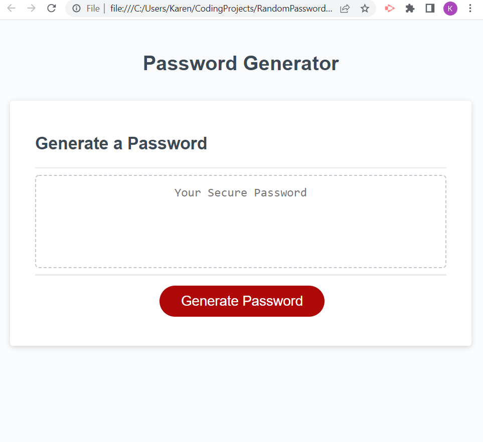
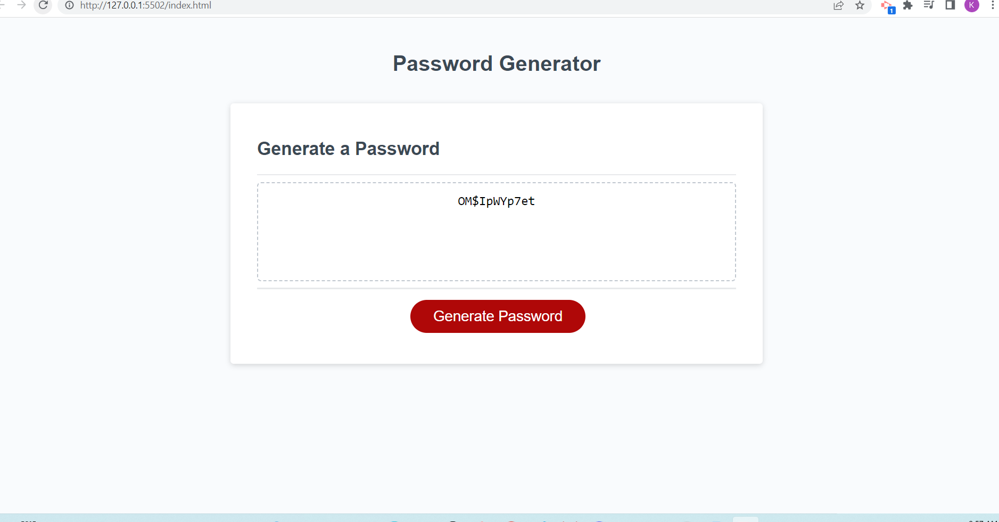

# RandomPassword2
Random Password Generator

## User Story
AS AN employee with access to sensitive data
I WANT to randomly generate a password that meets certain criteria
SO THAT I can create a strong password that provides greater security.

## Description
I am using javascript to create window prompts so that the user can specify which kinds of characters to be included in the randomly generated password. After the user specifies the password criteria, such as password length and which types of characters to use, then the password should generate, fulfilling all user-chosen requirements. 

## Languages
HTML
CSS
Javascript

##Screenshot

## Deployed Application
https://karenadkins84.github.io/RandomPassword2/
